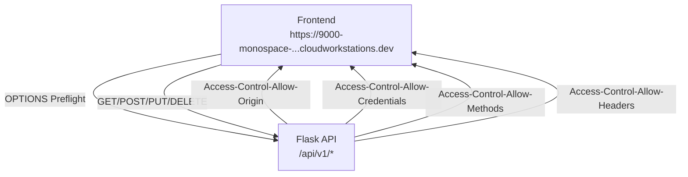

# CORS Configuration Implementation Plan

## Overview
This document outlines the changes needed to update the CORS configuration to include the frontend origin: `https://9000-monospace-iqrawartqui-academy-1712137068075.cluster-nxnw2gov3naqkvuxb437f67u5e.cloudworkstations.dev`

## Current CORS Configuration Analysis

### Location
File: `app/__init__.py` (lines 25-37)

### Current Setup
```python
allowed_origins = [
    "https://elearning-platform-7l0x.onrender.com",        # production frontend (Render)
    "http://localhost:5173",                              # Vite dev
    "https://9000-monospace-iqrawartqui-academy-...cloudworkstations.dev"  # votre dev host exact si nécessaire
]

CORS(
    app,
    resources={r"/api/v1/*": {"origins": allowed_origins}},
    supports_credentials=True,
    allow_headers=["Content-Type", "Authorization", "Accept"],
    methods=["GET", "POST", "PUT", "PATCH", "DELETE", "OPTIONS"]
)
```

### Issues Identified
1. The third origin is truncated and incomplete
2. The comment is in French, which should be updated for consistency

## Required Changes

### 1. Update Allowed Origins List
**File:** `app/__init__.py`
**Lines:** 25-29

**Current Code:**
```python
allowed_origins = [
    "https://elearning-platform-7l0x.onrender.com",        # production frontend (Render)
    "http://localhost:5173",                              # Vite dev
    "https://9000-monospace-iqrawartqui-academy-...cloudworkstations.dev"  # votre dev host exact si nécessaire
]
```

**Required Change:**
```python
allowed_origins = [
    "https://elearning-platform-7l0x.onrender.com",        # production frontend (Render)
    "http://localhost:5173",                              # Vite dev
    "https://9000-monospace-iqrawartqui-academy-1712137068075.cluster-nxnw2gov3naqkvuxb437f67u5e.cloudworkstations.dev"  # Cloud Workstations dev frontend
]
```

### 2. Update Comment Language
**File:** `app/__init__.py`
**Line:** 28

**Current Comment:**
```python
# votre dev host exact si nécessaire
```

**Required Change:**
```python
# Cloud Workstations dev frontend
```

## CORS Configuration Verification

### Current Configuration Coverage
✅ **Routes:** All API routes (`/api/v1/*`) are covered
✅ **Methods:** GET, POST, PUT, PATCH, DELETE, OPTIONS
✅ **Headers:** Content-Type, Authorization, Accept
✅ **Credentials:** Supports credentials (`supports_credentials=True`)
✅ **Preflight:** OPTIONS requests are handled via `before_request` decorator
✅ **Security:** Additional security headers via `after_request` decorator

### Architecture Flow


## Testing Strategy

### 1. Preflight Request Test
- Send OPTIONS request to any `/api/v1/*` endpoint
- Verify response includes:
  - `Access-Control-Allow-Origin: https://9000-monospace-iqrawartqui-academy-1712137068075.cluster-nxnw2gov3naqkvuxb437f67u5e.cloudworkstations.dev`
  - `Access-Control-Allow-Methods: GET,POST,PUT,PATCH,DELETE,OPTIONS`
  - `Access-Control-Allow-Headers: Content-Type,Authorization,Accept`
  - `Access-Control-Allow-Credentials: true`

### 2. Actual Request Test
- Send authenticated request with credentials
- Verify response includes the correct `Access-Control-Allow-Origin` header

### 3. Cross-Origin Verification
- Test requests from non-allowed origins should be blocked
- Test requests from allowed origins should succeed

## Implementation Steps

1. **Update the allowed origins list** in `app/__init__.py` (lines 25-29)
2. **Update the comment** for the third origin (line 28)
3. **Restart the Flask application** to apply changes
4. **Test CORS functionality** using the testing strategy above
5. **Verify all API endpoints** work correctly with the new origin

## Expected Outcome

After implementing these changes:
- The frontend will be able to make requests to the API
- CORS headers will be properly included in all responses
- Preflight requests will be handled correctly
- Credentials will be supported for authenticated requests

## Risk Assessment

### Low Risk
- Only adding an allowed origin (no removal of existing ones)
- CORS configuration is already well-established
- No breaking changes to existing functionality

### Mitigation
- Test thoroughly before deploying to production
- Monitor for any unexpected CORS-related errors
- Keep backup of original configuration if issues arise

## Dependencies

- Flask-CORS library (already installed, version 3.0.10)
- No additional dependencies required
- No database changes needed
- No configuration file changes needed